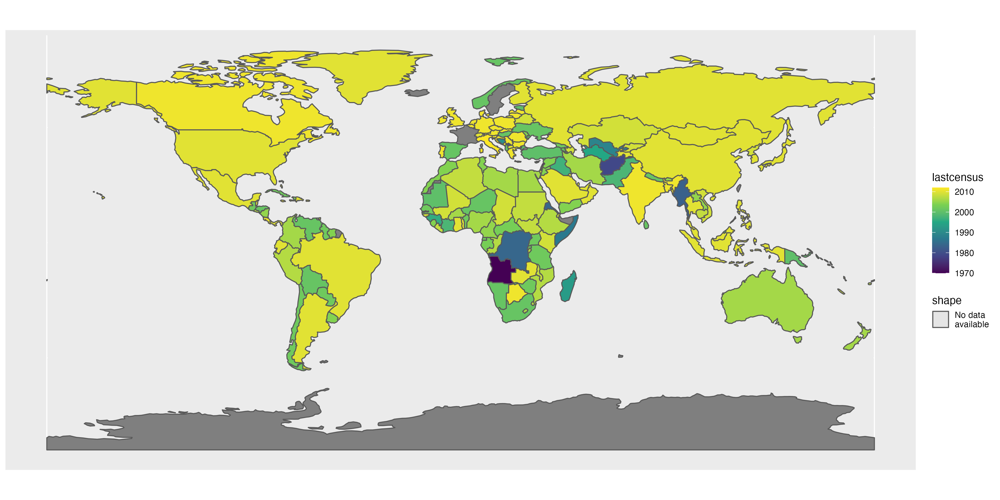

```{r setup, include=FALSE}
library(fontawesome)
library(sf)
library(rnaturalearthdata)
library(tidyverse)
library(here)
colours_ggplot2_components <- as.list(set_names(ggpomological:::pomological_palette[1:5], c("aesthetics", "geoms", "scales", "guides", "themes")))
countries_sf <- countries110 %>% 
  st_as_sf()
```


# fivethirtyeight::bechdel

.pull-left[

[FiveThirtyEight.com](https://fivethirtyeight.com) does really good data journalism.

They use R for most of their data analysis and make their code/cleaned datasets available through an R package - `{fivethirtyeight}`.

We're going to look at the dataset from this article: [The Dollar-And-Cents Case Against Hollywood’s Exclusion of Women](https://fivethirtyeight.com/features/the-dollar-and-cents-case-against-hollywoods-exclusion-of-women/)

]

.pull-right[

<caption>Alison Bechdel's 'The Rule' strip; Dykes to Watch Out For, 1985</caption>
<center><a href="https://www.npr.org/templates/story/story.php?storyId=94202522"></a>
</center>

]

---

### ggplot2: A Grammar of Graphics

`{ggplot2}` is an incredibly powerful and flexible tool for building static dataviz.

We can build (almost)<sup>1</sup> **any** static chart we can conceive of.
 
```{r, echo=FALSE, fig.height=4, fig.width=10, message=FALSE, warning=FALSE, dpi=150, cache=TRUE}
library("tidyverse")
library("lubridate")
library("patchwork")
library("fivethirtyeight")

gg_iris_scatter <- iris %>%
  ggplot(aes(x = Petal.Length,
             y = Sepal.Length)) +
  geom_point() +
  labs(x = "", y = "") +
  theme_bw()

gg_economics_line <- economics_long %>%
  ggplot() +
  geom_line(aes(date, value01, colour = variable), show.legend = FALSE) +
  labs(x = "", y = "") +
  theme_bw()


gg_marital_bar <- gss_cat %>%
  count(marital) %>%
  mutate(
    marital = fct_anon(marital, prefix = "type "),
    marital = fct_reorder(marital, n)) %>%
  ggplot() +
  geom_col(aes(x = marital, y = n)) +
  coord_flip() +
  labs(x = "", y = "") +
  theme_bw()

mtlong <- reshape2::melt(mtcars)


gg_quakes_histogram <- ggplot(quakes) +
  geom_histogram(aes(x = mag)) +
  labs(x = "", y = "") +
  theme_bw()

gg_bechden_violin <- bechdel %>%
  filter(domgross_2013 < 1e9) %>%
  # filter(domgross_2013 >= 1e6) %>%
  ggplot() +
  geom_violin(aes(x = clean_test,
                  y = domgross_2013),
              fill = "orange") +
  coord_flip() +
  labs(x = "", y = "") +
  theme_bw()

gg_diamonds_histogram <- ggplot(mtlong, aes(value)) + facet_wrap(~variable, scales = 'free_x') +
  geom_histogram(binwidth = function(x) 2 * IQR(x) / (length(x)^(1/3))) +
  labs(x = "", y = "") +
  theme_bw()
# ggsave("gg-saves/gg-iris-scatter.png",
#        gg_iris_scatter)
# ggsave("gg-saves/gg-economics-line.png",
#        gg_economics_line)

bump_data <- tribble(
  ~response, ~year, ~within_year_rank,
  "Yes", 2019, 1,
  "Maybe", 2019, 2,
  "No", 2019, 3,
  "Unsure", 2019, 4,
  "Unsure", 2016, 1,
  "No", 2016, 2,
  "Maybe", 2016, 3,
  "Yes", 2016, 4,
  "Yes", 2017, 3,
  "No", 2017, 2,
  "Unsure", 2017, 1,
  "Maybe", 2017, 4,
  "No", 2018, 1,
  "Yes", 2018, 2,
  "Maybe", 2018, 4,
  "Unsure", 2018, 3
)
gg_bump <- bump_data %>%
  ggplot(aes(x = year, y = within_year_rank, group = response)) +
    geom_line(aes(color = response), size = 2) +
    geom_point(aes(color = response), size = 4) +
    geom_point(color = "#FFFFFF", size = 1) +
    scale_y_reverse(breaks = 1:nrow(bump_data)) +
    scale_x_continuous(breaks = unique(bump_data$year), minor_breaks = unique(bump_data$year)) +
  coord_cartesian(ylim = c(1, length(unique(bump_data$response)))) +
  theme_bw() +
  theme(axis.ticks.y = element_blank(),
        axis.text.y = element_blank()) +
  labs(x = "", y = "") 


gg_iris_scatter + gg_economics_line + gg_marital_bar + plot_layout(ncol = 3) + 
  gg_quakes_histogram + gg_bechden_violin + gg_bump

```


.footnote[
[1] - Dual y-axis charts must be transformations of one another ([for good reasons](https://stackoverflow.com/a/3101876/1659890))
]

---

### ggplot2: Charts are built, not chosen

.pull-left[
The most common workflow for dataviz tools is:

1. Choose the chart we want

1. Find the charting function for that chart

1. Specify the options/attributes/style of the chart
]

.pull-right[

But in `{ggplot2}`, things are much different:

1. Choose the chart we want

1. Ensure the **data** contains the necessary structure for our chart

1. Build up a chart by mapping our data to the **aesthetics** of the chart

1. Customise the chart **scales** and **theme**.

]

---

### Building blocks of a {ggplot2} chart

- `r fa(name = "ruler-combined", fill = colours_ggplot2_components$aesthetics)` <span style='color:`r colours_ggplot2_components$aesthetics`'>Aesthetics</span>

- `r fa(name = "shapes", fill = colours_ggplot2_components$geoms)` <span style='color:`r colours_ggplot2_components$geoms`'>Geoms</span>

- `r fa(name = "balance-scale", fill = colours_ggplot2_components$scales)` <span style='color:`r colours_ggplot2_components$geoms`'>Scales</span>

- `r fa(name = "tags", fill = colours_ggplot2_components$guides)` <span style='color:`r colours_ggplot2_components$geoms`'>Guides</span>

- `r fa(name = "paint-roller", fill = colours_ggplot2_components$themes)` <span style='color:`r colours_ggplot2_components$themes`'>Theme</span>

---

### Building blocks of a {ggplot2} chart

- `r fa(name = "ruler-combined", fill = colours_ggplot2_components$aesthetics)` <span style='color:`r colours_ggplot2_components$aesthetics`'>Aesthetics</span>: these create mappings between columns in datasets and the coordinate system of the chart.

---

### Building blocks of a {ggplot2} chart

- `r fa(name = "ruler-combined", fill = colours_ggplot2_components$aesthetics)` <span style='color:`r colours_ggplot2_components$aesthetics`'>Aesthetics</span>

- `r fa(name = "shapes", fill = colours_ggplot2_components$geoms)` <span style='color:`r colours_ggplot2_components$geoms`'>Geoms</span>: these use the aesthetics to draw layers onto our charts

---

### Geoms & categorical variables

In R we use `factors` to control the order in which geoms are drawn (and appear in legends)

.pull-left[

- Default (alphabetical) ordering

```{r, eval=TRUE,echo=FALSE, dpi=150, out.width='100%', fig.asp=1/2}
ggplot2::msleep %>% 
  count(vore) %>% 
  ggplot(aes(x = n,
             y = vore)) +
  geom_col() +
  theme_gray(18)
```
]

.pull-right[

- Reordered by another column

```{r, eval=TRUE,echo=FALSE, dpi=150, out.width='100%', fig.asp=1/2}
ggplot2::msleep %>% 
  count(vore) %>% 
  mutate(vore = fct_reorder(vore, n)) %>% 
  ggplot(aes(x = n,
             y = vore)) +
  geom_col() +
  theme_gray(18)
```
]

---

### Building blocks of a {ggplot2} chart

- `r fa(name = "ruler-combined", fill = colours_ggplot2_components$aesthetics)` <span style='color:`r colours_ggplot2_components$aesthetics`'>Aesthetics</span>

- `r fa(name = "shapes", fill = colours_ggplot2_components$geoms)` <span style='color:`r colours_ggplot2_components$geoms`'>Geoms</span>

- `r fa(name = "balance-scale", fill = colours_ggplot2_components$scales)` <span style='color:`r colours_ggplot2_components$geoms`'>Scales</span>: these affect how the aesthetics appear in the chart

---

### Building blocks of a {ggplot2} chart

- `r fa(name = "ruler-combined", fill = colours_ggplot2_components$aesthetics)` <span style='color:`r colours_ggplot2_components$aesthetics`'>Aesthetics</span>

- `r fa(name = "shapes", fill = colours_ggplot2_components$geoms)` <span style='color:`r colours_ggplot2_components$geoms`'>Geoms</span>

- `r fa(name = "balance-scale", fill = colours_ggplot2_components$scales)` <span style='color:`r colours_ggplot2_components$scales`'>Scales</span>

- `r fa(name = "tags", fill = colours_ggplot2_components$guides)` <span style='color:`r colours_ggplot2_components$geoms`'>Guides</span>: these affect how the guides (or legends) are constructed from the aesthetics and scales.


---

### Building blocks of a {ggplot2} chart

- `r fa(name = "ruler-combined", fill = colours_ggplot2_components$aesthetics)` <span style='color:`r colours_ggplot2_components$aesthetics`'>Aesthetics</span>

- `r fa(name = "shapes", fill = colours_ggplot2_components$geoms)` <span style='color:`r colours_ggplot2_components$geoms`'>Geoms</span>

- `r fa(name = "balance-scale", fill = colours_ggplot2_components$scales)` <span style='color:`r colours_ggplot2_components$scales`'>Scales</span>

- `r fa(name = "tags", fill = colours_ggplot2_components$guides)` <span style='color:`r colours_ggplot2_components$guides`'>Guides</span>

- `r fa(name = "paint-roller", fill = colours_ggplot2_components$themes)` <span style='color:`r colours_ggplot2_components$themes`'>Theme</span>: this affects the look and feel of the chart.

---

class: inverse, center, middle

# Why is {ggplot2} awesome?

---

### Maps with {ggplot2}

We can use {ggplot2} to make maps

```{r, eval=FALSE}
ggplot() +
  geom_sf(data = countries_sf,
          aes(fill = lastcensus,
              shape = "No data\navailable")) +
  scale_fill_viridis_c()
```

```{r, eval=FALSE, include=FALSE}
gg_census_map %>% 
  ggsave("gg_census_map.png",
         .,
         width = 14,
         height = 7)
```



---

### Animated GIF with {gganimate}

The [{gganimate}](https://gganimate.com/) package allows us to create animated GIF with {ggplot2}.

> GIFS?

<center>

</center>

---

### {ggplot2} extensions

There are 100+ registered {ggplot2} extensions - [exts.ggplot2.tidyverse.org/gallery](https://exts.ggplot2.tidyverse.org/gallery/)


