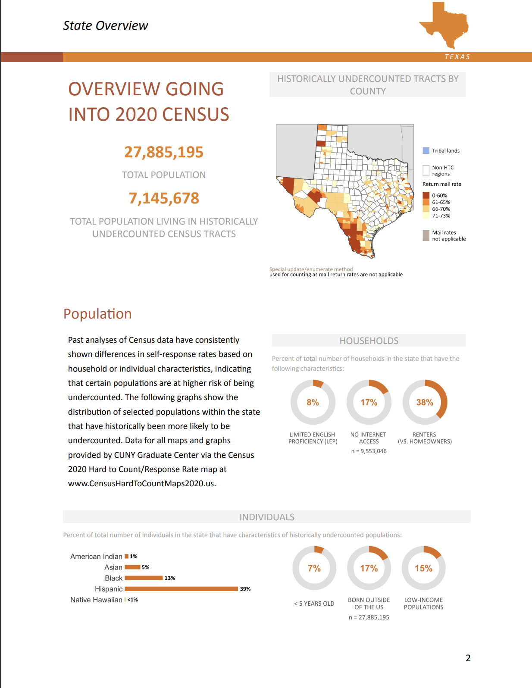

## ... RStudio projects?

We're using RStudio projects because they improve the reproducibility (and transportability) of our code.

Let me demonstrate how by quickly creating a text file...

---

### Production-level reproducibility

The [{renv}](https://rstudio.github.io/renv/index.html) package snapshots R packages into your RStudio project - ensuring your code will run into the future.

---

class: inverse, center, middle

# RMarkdown

---

## Life without RMarkdown

1. Write your report in Word

1. Write your code in R

1. Copy and paste your charts into Word

1. Update different parts of the report/code

1. ... are the charts up to date? ... are the figures in text (eg 73%) up to date?

There's a disconnect between the data and report - which is ripe for reproduciblity issues for both the author and reader.

---

## RMarkdown is incredible

RMarkdown is a technology that allows you to build reports, presentations and more that incorporate R code.

Here are just some of the things you can build:

- Interactive HTML reports (containing {htmlwidgets})

- Beautiful PDF reports [for printing]

- Fully fledged books - remember [R for Data Science](https://r4ds.had.co.nz/)

- Word documents [because sometimes you have to make them]

- PowerPoint slides

- Data blogs and other websites

---

### Parameterised RMarkdown docs

The thing that makes RMarkdown particularly powerful is the ability to programmatically generate **many** reports from datasets.

.pull-left[

I worked on a consultancy project with **R for the Rest of Us** to build reports for all US states.

The PDF reports sucked in text from .docx files, Excel workbooks and the US Census API for each state.

<a href='https://funderscommittee.org/2020censusstatereports'>funderscommittee.org/2020census statereports</a>
]

.pull-right[

]

