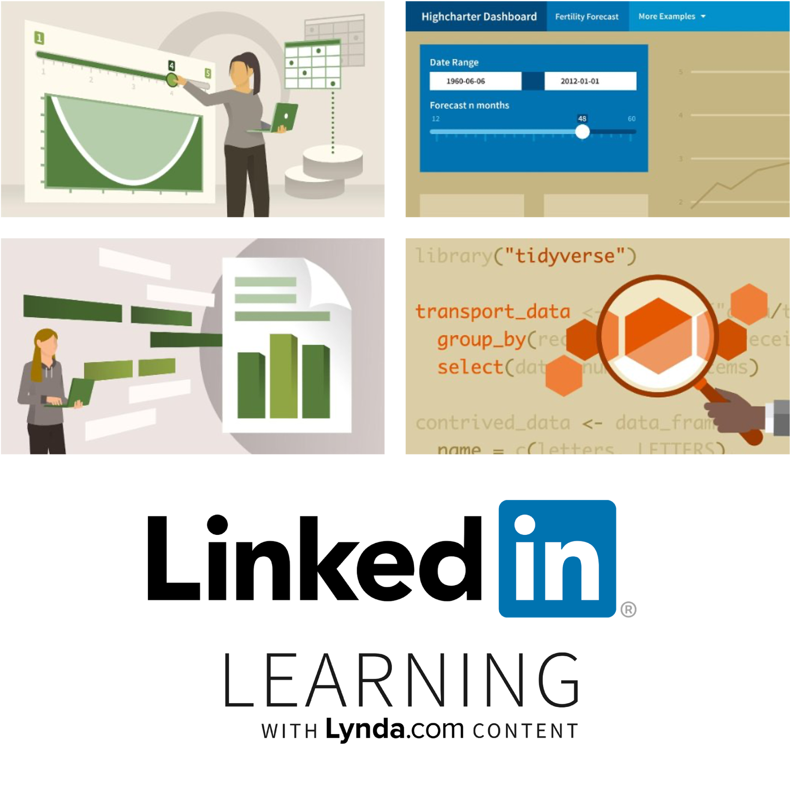

# R for Data Science Book

.pull-left[

The [R for Data Science book](https://r4ds.had.co.nz/index.html) is really awesome.

 

The [R for Data Science Online Learning Community](https://www.rfordatasci.com/) has a Slack group that will help you through the exercises.

]

.pull-right[

]

---

## #rstats

.footnote[
Want to learn more about Twitter and R? [t4rstats.com](https://www.t4rstats.com)
]

---

class: middle

.pull-left[
R in 3 Months is a commercial training course I co-instruct with David Keyes.

It covers data wrangling, visualisation and RMarkdown.

There are weekly assignments where you use **your own datasets** and get feedback videos from me.
]

.pull-right[

]

---

class: middle

.pull-left[
I have {shiny}, {htmlwidget} and RMarkdown training courses on LinkedIn Learning.

Many universities now provide access to LinkedIn Learning for all staff and students.

Access is included with a free trial of LinkedIn Premium.

]

.pull-right[

]

